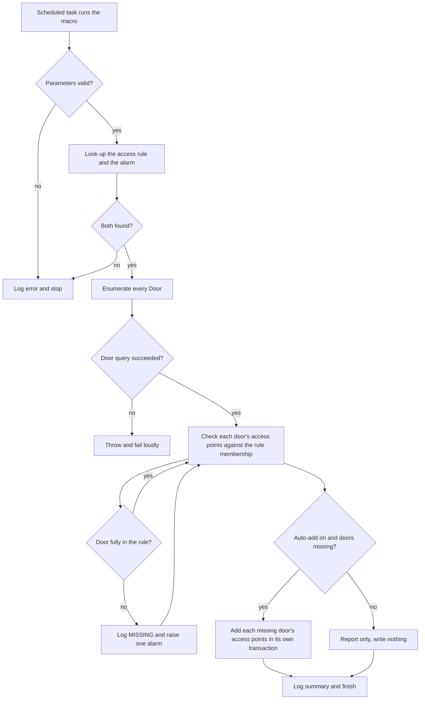
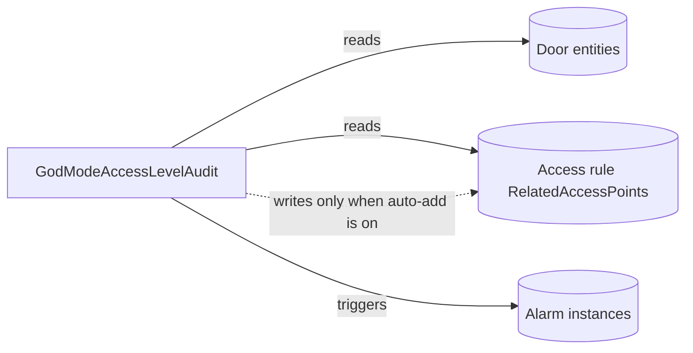

# God Mode Access Level Audit

Checks, on a schedule, that every door in the system is included in a chosen access rule (the one we call "God Mode"). If a door is missing, the macro raises an alarm naming that door, and can optionally add the door to the rule automatically.

| | |
|---|---|
| **Platform** | Security Center 5.13 (also targets 5.12) |
| **Macro file** | `GodModeAccessLevelAudit.cs` (in this folder) |
| **Trigger** | Scheduled (a Config Tool scheduled task). Also runs on demand. |
| **Category** | `Access Levels` |
| **Visibility** | Public (security and IP review completed 2026-06-06) |
| **Author** | Matthew Netardus |

## Intent

A door that gets onboarded but never added to the God Mode rule is a silent gap in coverage. This macro closes that gap by auditing every door against the rule on a schedule, raising an alarm for any door that is missing, and optionally adding the missing door. It fails closed, so a door that is not in the rule is always flagged.

What we call "God Mode" is, in SDK terms, an **Access Rule**. Security Center 5.13 has no "Access Level" entity. Rule membership is stored as a list of **access points** (a door has two sides, each with reader, request-to-exit, and sensor access points), not whole doors, which is why the macro audits a door's access points.

## Data it touches

| Item | Type | Read / Write | Notes |
|------|------|--------------|-------|
| Door entities | Door | Read | Enumerated once with an `EntityConfigurationQuery`, then read from the cache. |
| `Door.DoorSideIn` / `DoorSideOut` (Reader, Rex, EntrySensor) | AccessPoint | Read | The access points checked against the rule. |
| `AccessRule.RelatedAccessPoints` | Access rule membership | Read | The authoritative membership the audit checks against. |
| `AccessPoint.AccessRules` | Access point rule list | Read and Write | Read for diagnostics only. Written only when auto-add adds a door. |
| Alarm instance | Alarm | Write | One raised per missing door. |
| `GodModeAccessRule` | Parameter (Guid) | Read | Which rule must contain every door. |
| `MissingDoorAlarm` | Parameter (Guid) | Read | Which alarm to raise. |
| `EnableAutoAdd` | Parameter (Boolean) | Read | Whether to add missing doors. |

The macro needs no custom fields.

## How it works each run

1. Validates the parameters. If a required GUID is empty, it logs an error and stops.
2. Looks up the access rule and the alarm. If either is missing, it logs an error and stops.
3. Enumerates every Door in the system with one cached query.
4. Captures the rule's membership (`RelatedAccessPoints`) once.
5. For each door, checks whether its access points are in that membership. The check fails closed: a door not in the rule is flagged.
6. For each missing door, logs a `MISSING` line and raises one alarm with the door attached.
7. If `EnableAutoAdd` is on, adds each missing door's access points to the rule, each door in its own transaction so one failure does not block the others.
8. Logs a summary: doors scanned, doors missing, whether auto-add ran.

If it cannot even read the list of doors, it fails loudly rather than reporting a misleading "nothing missing".

## Flowchart

## Architecture impact

## Prerequisites

Before importing, make sure these exist in Security Center:

- The **access rule** that should contain every door (your God Mode rule).
- An **alarm** entity to raise for missing doors. Set its recipients so the right operators see it in Alarm Monitoring.

No custom fields are required.

## Parameters

| Parameter | Type | What to set it to |
|-----------|------|-------------------|
| `GodModeAccessRule` | Guid | Pick your God Mode access rule in the entity browser. |
| `MissingDoorAlarm` | Guid | Pick the alarm to raise for missing doors. |
| `EnableAutoAdd` | Boolean | Leave `false` at first (report only). Turn on after a lab run. |

## Import and schedule

1. Open Config Tool, then System, then Macros.
2. Create a new Macro entity and name it `God Mode Access Level Audit`.
3. Open its source tab and paste the entire contents of `GodModeAccessLevelAudit.cs`.
4. Apply. Security Center compiles on apply. Fix any reported errors (there should be none).
5. Set the parameters above on the default execution context.
6. Create a scheduled task (Config Tool, then Tasks, then Scheduled tasks) with action "Run a macro", select this macro, and set a daily recurrence at an off-peak time such as 02:00. The macro does not schedule itself.

## Failure modes

| What can fail | How it shows in the log | Effect |
|---------------|-------------------------|--------|
| A required parameter is not set | `parameter is empty` error line | Run stops before reading anything. |
| The rule or alarm GUID points to a deleted entity | `No AccessRule found` or `No Alarm found` | Run stops. |
| The door enumeration query fails | `Door enumeration query failed` then `Execute() failed.` | Run fails loudly, no false all-clear. |
| A door is deleted mid-run | `vanished mid-run; skipping` warning | That door is skipped, the run continues. |
| An auto-add write is rejected (no rights) | `Failed to auto-add door` | That door stays flagged, other doors continue. |

## Risks

- **Fail-closed by design.** A door not in the rule is always flagged, so the audit never under-reports coverage.
- **Auto-add writes membership.** The default is off (report only), and the macro never removes membership. Confirm the write behavior in a lab before enabling it in production, because the guide does not document whether adding on the access-point side is reflected on the rule side. The audit is safe regardless, since it keeps alarming a door that was not truly added.
- **No per-door exclusions.** Every door is expected in the rule.
- **The door query has no timeout** (the SDK call offers none). It runs once per scheduled run at an off-peak time, so the risk is low.

## Rollback / disabling

- **Stop it running:** disable the scheduled task (Config Tool, then Tasks, then Scheduled tasks, set inactive), and/or set the Macro entity to disabled.
- **Undo an auto-add:** the macro never removes doors. If a run added something it should not have, remove those access points from the rule by hand in Config Tool.

## Log strings worth grepping

| Meaning | String |
|---------|--------|
| Run started / finished | `Execute() started.` / `Execute() completed.` |
| Doors read | `Enumerated N door(s).` |
| A missing door | `MISSING: door '<name>'` (includes `ruleList=` and `apRules=`) |
| Alarm raised | `Raised alarm instance` |
| Auto-add result | `Auto-added door` / `Failed to auto-add door` |
| Run failed | `Execute() failed.` |

## Customizing for your environment

This macro is a starting point, not a finished product. The changes people make most often:

- **Audit a different rule.** Point `GodModeAccessRule` at whichever access rule should contain every door. Nothing in the code is tied to one rule.
- **Turn on auto-add once you trust it.** Leave `EnableAutoAdd` off while you read the reports. Set it true when the missing-door list looks right, and the macro adds the access points for you.
- **Audit more than one rule.** The simplest way is to create a second Macro entity from the same file and point it at the other rule. If you would rather one run cover several rules, change `GodModeAccessRule` from a single parameter into a short list and loop over it in `Execute()`.
