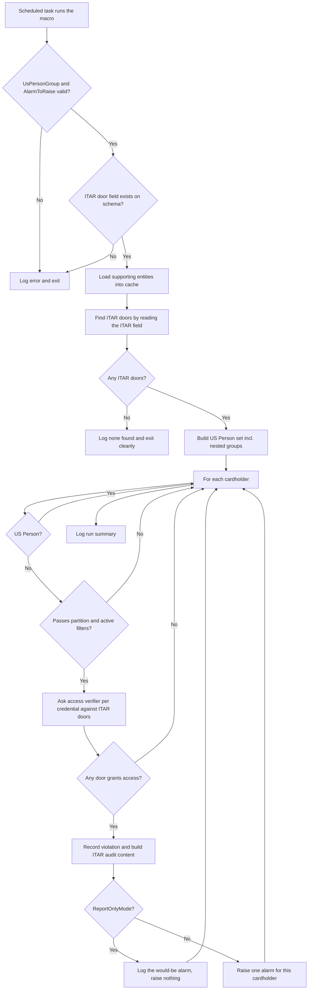
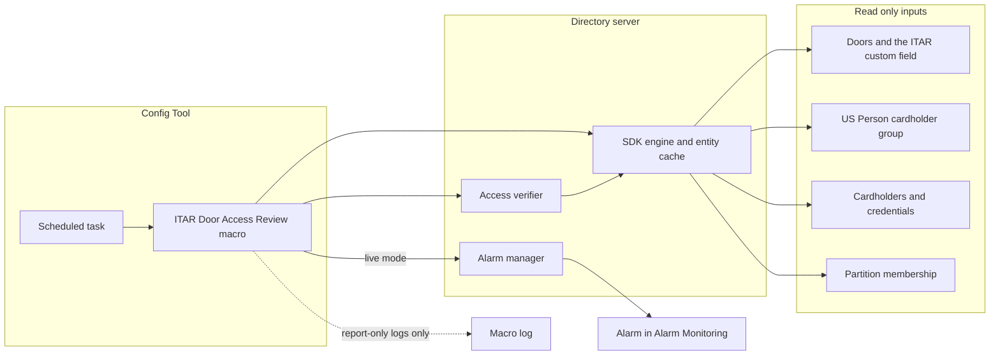

# ITAR Door Access Review

A Genetec Security Center macro that finds, on a schedule, every cardholder who is
**not** a member of the designated **US Person** cardholder group but who can still be
granted access to at least one **ITAR marked door**. For each such cardholder it raises
one alarm. The macro is **read only**: it never changes access, membership, or
configuration. Its only outward effect is raising the alarm you choose, and only once
you turn report-only mode off.

## At a glance

| Property | Value |
|----------|-------|
| Platform | Security Center 5.13 (also targets 5.12) |
| Macro file | `ItarDoorAccessReview.cs` (in this folder) |
| Trigger | A Config Tool **Scheduled task** (see *Scheduling* below) |
| **Visibility** | Public (security and IP review completed 2026-06-06) |
| Modifies anything? | **No.** Read only. Raises the chosen alarm when live. |
| Compliance relevance | **ITAR (22 CFR 120-130).** ISSM review required before live alarms. |

> **Terminology note.** A door is marked ITAR by a **custom field** named `ITAR` on the
> Door entity type. "Access" here means the access control system **would grant** the
> cardholder entry at review time, computed by the SDK access verifier against each ITAR
> door's access points. It does not mean the person physically passed through the door.

---

## What it does, each run

1. Validates the two required parameters and confirms they point at a real cardholder
   group and a real alarm.
2. Resolves the Door `ITAR` custom field definition. If that field is missing from the
   schema, it **fails loudly** rather than reporting "no ITAR doors", because a missing
   field in an ITAR review is a configuration bug, not an all clear.
3. Loads the supporting entities into the cache once (access points, access rules,
   schedules, credentials, cardholder groups), so the access verifier has what it needs.
4. **Finds ITAR doors:** reads every door's `ITAR` field and keeps the doors whose value
   means true. If there are none, it logs that and exits cleanly.
5. Builds the **US Person set**: the cardholder group's members, expanded through any
   nested cardholder groups, as a flat set of cardholder GUIDs.
6. Walks every cardholder, skipping US Persons, and (optionally) limiting to one
   partition and to active cardholders only.
7. For each remaining cardholder, asks the access verifier whether any of the
   cardholder's credentials would be **granted** at any ITAR door. The first credential
   that grants access marks the cardholder as a violation (the rest are skipped).
8. For each violating cardholder it builds an audit record (cardholder name and GUID, the
   ITAR door or doors that grant access, the execution context as the operator, and a UTC
   timestamp), logs it, and either simulates or raises one alarm depending on the mode.
9. Logs a summary: ITAR doors found, cardholders checked, violations, alarms raised or
   simulated, and errors.

If it cannot read the doors or the cardholders, it **fails loudly** (logs an error)
rather than silently reporting "no violations".

---

## How it flows

## Architecture impact

The macro reads from the Directory's entity cache and the access verifier, and writes
nothing back to configuration. The only state it creates is an alarm instance, and only
when report-only mode is off.

---

## Everything it reads and writes

### Entities read

| Entity | Why |
|--------|-----|
| Cardholder group (the US Person group) | Source of the allowed members, expanded through nested groups. |
| Cardholder | The population to review; also the alarm source and the audit name. |
| Credential | Each cardholder's credentials are checked at the ITAR doors. |
| Door | Enumerated to find ITAR doors and to name them in the audit record. |
| Access point, Access rule, Schedule | Loaded into the cache so the access verifier can decide grants. |
| Alarm (the target) | Validated so a bad parameter is caught before the review runs. |
| Partition membership | Read per cardholder when `PartitionScope` is set. |

### Custom fields read

| Custom field | Entity type | Meaning |
|--------------|-------------|---------|
| `ITAR` | Door | A door is ITAR controlled when this field equals the true value. Name is case sensitive and must match Config Tool exactly. |

### Entities written

| Entity | What |
|--------|------|
| Alarm instance | One per violating cardholder, **only when `ReportOnlyMode` is false**. No other writes. |

### Parameters

| Parameter | Type | Default | What to set it to |
|-----------|------|---------|-------------------|
| `UsPersonGroup` | Guid | (none) | The US Person cardholder group. Required. |
| `AlarmToRaise` | Guid | (none) | The alarm to raise per violation. Required. |
| `ReportOnlyMode` | Boolean | `true` | Leave `true` for the first run. Set `false` to raise alarms. |
| `ActiveCardholdersOnly` | Boolean | `false` | Leave `false` to also catch inactive non US Persons that still hold ITAR access. |
| `PartitionScope` | Guid | `Guid.Empty` | Leave empty to check all sites, or pick one partition to limit the review. |

---

## Prerequisites

Before importing, make sure these exist in Security Center:

- A **custom field named `ITAR`** on the **Door** entity type. The name is case
  sensitive. Confirm both the name and the exact value that means "true".
- The **US Person cardholder group**, with its members populated.
- An **alarm** entity to raise for violations. Set its recipients so the right operators
  see it in Alarm Monitoring.

---

## Importing into Config Tool

1. Open **Config Tool then System then Macros** (or **Tasks then Macros**).
2. Create a new **Macro** entity, for example name it *ITAR Door Access Review*.
3. Open its **Properties / source** tab and **paste the entire contents of
   `ItarDoorAccessReview.cs`**.
4. Apply. Security Center compiles the macro on apply. Fix any reported compile errors
   before continuing (there should be none).
5. Set the parameters on the macro's default execution context (see the table above).

---

## Scheduling (how to make it run on a schedule)

Security Center runs a macro on a schedule through a **Scheduled task**.

1. Open **Config Tool then Tasks then Scheduled tasks**.
2. Click **+ Scheduled task**, give it a name, for example *Weekly ITAR Access Review*.
3. Set **Action = Run a macro**, and select the *ITAR Door Access Review* macro.
4. Set the **Recurrence** to when you want it to run, at an **off-peak time**.
5. **Apply.**

> The macro does **not** schedule itself. It is a run to completion macro with no internal
> timers or loops, so the Scheduled task is what controls timing.

---

## Recommended rollout

1. **Report-only first.** With `ReportOnlyMode = true`, run the macro on demand and read
   the macro log. Confirm the ITAR door count is right and that the flagged cardholders
   are the ones you expect.
2. **Confirm the ITAR field value.** Check the log line that prints the ITAR field
   `ValueType` and a sample ITAR door's value. Make sure the macro's notion of "true"
   matches Config Tool.
3. **Have the ISSM review the findings.** ITAR alarms are compliance events. The ISSM
   must review the report-only output before any live alarm is enabled.
4. **Then go live.** Set `ReportOnlyMode = false`. Run, and confirm one alarm appears per
   violating cardholder in Alarm Monitoring.
5. **Schedule it** once you are confident.

---

## Deployment checklist

- [ ] The Door custom field is named exactly `ITAR` (case sensitive), and you have
      confirmed the exact stored value that means true.
- [ ] `UsPersonGroup` is set to the US Person cardholder group and its members are
      populated.
- [ ] `AlarmToRaise` is set to the alarm, and the alarm has the right recipients.
- [ ] The macro ran once with `ReportOnlyMode = true` and the log was reviewed.
- [ ] The executing account can read access control configuration, read custom fields,
      read partition membership, and trigger the chosen alarm. The SDK is already
      authenticated as admin, so no login handling is required.
- [ ] **ISSM review is complete** before flipping `ReportOnlyMode` to false.
- [ ] The VERIFY items below were validated on the Windows 5.13 target.

### VERIFY items (need live 5.13 validation)

1. The Door `ITAR` custom field data type (Text, value list, or Boolean) and the exact
   stored representation of the true value. The macro handles both a Boolean field and a
   Text or value list field whose value equals `True`, but confirm the real type and the
   exact stored string in Config Tool.
2. The access verifier expands a door GUID (passed as an access point group) into its
   access points, and `Granted` is the correct signal here. Antipassback is not
   considered by the verifier, which is acceptable for entitlement detection.
3. Reading a cardholder's partitions via the engine returns what the `PartitionScope`
   filter expects, and the partition model matches the single, non hierarchical
   `PartitionScope` assumption.
4. A cardholder's credentials enumerate as credential entities whose GUID is the value
   the access verifier expects for the credential.

---

## What an operator sees

For each violating cardholder, an alarm instance appears in **Alarm Monitoring** with the
context describing the cardholder, the ITAR door or doors that grant access, the execution
context as the operator, and a UTC timestamp. The cardholder and the granting doors are
attached to the alarm. One alarm is raised per violating cardholder.

---

## Known limitations

- **Entitlement, not entry.** The macro reports who the system **would grant** access to
  at the ITAR doors at review time. It does not read door open history.
- **One credential decides.** Once any of a cardholder's credentials would be granted at
  any ITAR door, the cardholder is a violation and the remaining credentials are not
  checked. The audit names the doors from that first granting credential.
- **Verification gaps are logged, not alarmed.** If the verifier returns an inconclusive
  or error result for a credential at a door, the macro logs a warning rather than raising
  an alarm. Review those warnings, since an inconclusive result can hide a real grant.
- **The queries have no timeout** (the SDK's query call does not offer one). The macro
  runs once per scheduled run at an off-peak time, so this is low risk, but be aware on
  very large or unresponsive systems.

---

## Rollback / disabling

- **Stop it running:** disable the **Scheduled task** (Config Tool then Tasks then
  Scheduled tasks then set inactive), and/or set the **Macro** entity's state to Disabled.
- **Stop alarms without stopping the review:** set `ReportOnlyMode = true`. The macro keeps
  logging findings but raises no alarms.
- The macro never writes configuration, so there is nothing else to undo.

---

## Log strings worth grepping

| Meaning | String |
|---------|--------|
| Run started / finished | `Execute() started.` / `Execute() completed.` |
| ITAR field resolved | `ITAR door field resolved.` |
| ITAR doors found | `are ITAR controlled.` |
| A violation | `ITAR VIOLATION:` |
| Verification gap (inconclusive or error) | `Access verification gap for cardholder` |
| Alarm raised | `Raised alarm instance` |
| Report-only simulation | `Would have raised alarm` |
| Run summary | `Review summary:` |
| Run failed (review could not complete) | `Execute() failed.` |
