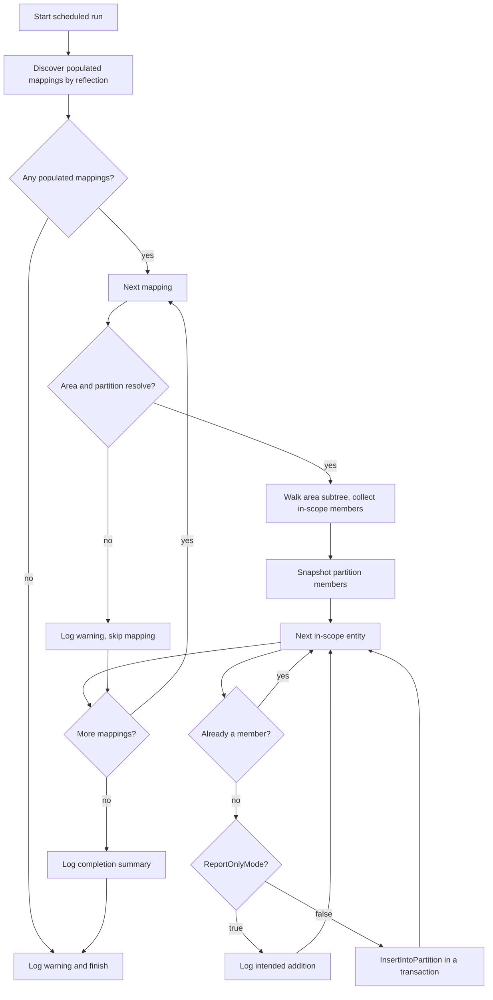
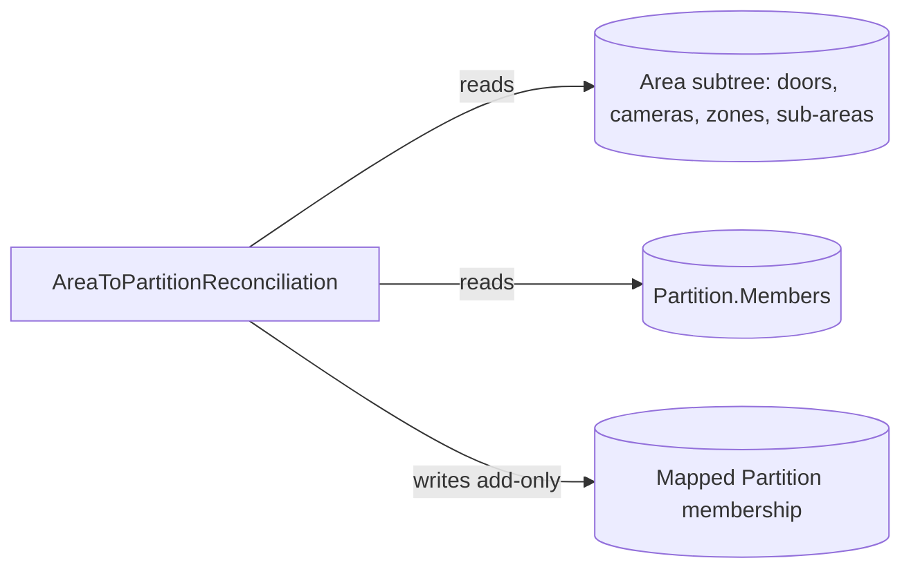

# Area-to-Partition Reconciliation

An add-only scheduled macro that keeps each mapped partition complete for every in-scope entity living inside a mapped area's subtree, so partition-scoped access and integrations never silently miss an entity.

| | |
|---|---|
| **Platform** | Security Center 5.13 (also targets 5.12) |
| **Macro file** | `AreaToPartitionReconciliation.cs` (in this folder) |
| **Trigger** | Scheduled |
| **Category** | `Integrations` |
| **Visibility** | Public (security and IP review completed 2026-06-06) |
| **Author** | Matthew Netardus |

## Intent

In a multi-site system, partitions define visibility boundaries while areas define physical groupings. The two drift apart as new doors, cameras, and zones are added under an area but never get placed in the partition that should see them. This macro closes that gap: for each configured area-to-partition mapping, it ensures every in-scope entity in the area's subtree is a member of the mapped partition. It only ever adds membership, never removes it, and a system already in sync produces no changes.

## Data it touches

| Item | Type | Read / Write | Notes |
|------|------|--------------|-------|
| `ReportOnlyMode` | parameter (Boolean) | Read | When true (the default), logs intended additions and writes nothing. |
| `Area01`..`Area50` | parameter (Guid) | Read | The area side of each mapping slot. Empty means the slot is unused. |
| `Partition01`..`Partition50` | parameter (Guid) | Read | The partition side of each mapping slot. Empty means the slot is unused. |
| Area subtree members | Door / Camera / Zone | Read | `Area.AllDoors`, `Area.Cameras`, `Area.Zones` for each area and sub-area. |
| Sub-areas | Area | Read | `Area.CaptiveAreas`, used to recurse the area hierarchy. |
| Partition members | Partition | Read | `Partition.Members`, snapshotted once per mapping to decide what is missing. |
| Partition membership | Partition | Write | `InsertIntoPartition`, add-only, and only when `ReportOnlyMode` is false. |

## How it works each run

1. Discover the populated area-to-partition mapping pairs by reflecting over the macro's own `AreaNN` and `PartitionNN` Guid properties and pairing them by number. Slots with either GUID empty are skipped.
2. For each populated mapping, resolve the area and the partition. If either is missing, log a warning and move to the next mapping.
3. Walk the area's subtree: collect the in-scope members of the area, then recurse into every descendant sub-area and collect theirs. An entity in a sub-area is therefore swept by its own mapping and by every ancestor area's mapping.
4. Snapshot the partition's current members. For each in-scope entity not already a member, either log the intended addition (report-only) or add it inside its own transaction (live).
5. Log a per-mapping line and a final completion summary. A failure in one mapping is logged and does not stop the others.

## Flowchart

## Architecture impact

## Prerequisites

- The areas and partitions you intend to map already exist, and you have their entity GUIDs ready to paste into the parameter slots.
- The macro user has rights to modify partition membership (ManagePartitionMemberships, or write access on each mapped partition).
- Custom fields: none. The mappings come entirely from parameters.
- No login handling is needed. The SDK is already authenticated as admin when a macro runs on the Directory.

## Parameters

| Parameter | Type | What to set it to |
|-----------|------|-------------------|
| `ReportOnlyMode` | Boolean | Leave true for the first run to preview changes in the log. Set false only after reviewing the preview and gaining ISSM awareness. |
| `Area01` .. `Area50` | Guid | The source area for each mapping. Pick the area in the entity browser. Leave unused slots empty. |
| `Partition01` .. `Partition50` | Guid | The target partition for the same-numbered area. Leave unused slots empty. |

To add a mapping beyond 50, add one `AreaNN`/`PartitionNN` property pair at the tail of the block in the `.cs` file. To remove one, delete a pair at the tail. The count is defined only by that block.

## Import and schedule

1. Open Config Tool, then System, then Macros.
2. Create a new Macro entity and name it `Area-to-Partition Reconciliation`.
3. Open its source tab and paste the entire contents of `AreaToPartitionReconciliation.cs`.
4. Apply. Security Center compiles on apply. Fix any reported errors.
5. Set the parameters: leave `ReportOnlyMode` true, then fill in the area and partition pairs you need.
6. Create a Scheduled task that runs this macro off-hours. The macro does no scheduling of its own.
7. Before enabling live writes, work through the VERIFY list in the `AreaToPartitionReconciliation.cs` header against the installed 5.13 reference on the Windows target. These are the SDK behaviors that could not be confirmed from project knowledge alone.
8. Review the preview log. Only after that, and with ISSM awareness, set `ReportOnlyMode` false to enable live writes.

## Failure modes

| What can fail | How it shows in the log | Effect |
|---------------|-------------------------|--------|
| No populated mappings | `No populated mappings found.` | Nothing is changed. Fill in at least one pair. |
| An area or partition GUID points to a deleted entity | `not found or not an Area` / `not found or not a Partition` | That one mapping is skipped, the rest run. |
| A sub-area cannot be resolved | `Sub-area ... could not be resolved.` | That sub-area's subtree is skipped, the rest of the area runs. |
| Macro user lacks partition write rights | `Failed to add '...' ... Check the macro user's ManagePartitionMemberships rights.` | That entity is counted as an error, the run continues. |
| Reflection over own properties is blocked in the sandbox | `Execute() failed.` with a reflection exception | No changes. Fall back to an explicit pair list (see VERIFY 2 in the macro header). |

## Risks

- This macro performs writes that change partition membership and therefore entity visibility across multi-site scope. The default `ReportOnlyMode` true posture means it previews before it ever writes, and it is add-only so it can never narrow visibility by removing membership.
- A wrong area-to-partition pair would add entities to a partition that should not see them. The report-only preview is the control: review the log before enabling live writes.

## Rollback / disabling

- **Stop it running:** disable the Scheduled task that runs the macro, or set `ReportOnlyMode` back to true so it previews without writing.
- **Undo its writes:** the macro is add-only, so any unintended addition is reversed by removing the entity from the partition manually in Config Tool. The per-entity `Added '...'` log lines list exactly what was added in each run.

## Log strings worth grepping

| Meaning | String |
|---------|--------|
| Run started / finished | `Execute() started.` / `Execute() completed.` |
| Report-only mode and mapping count | `ReportOnlyMode=` |
| Intended addition (preview) | `[ReportOnly] Would add` |
| Actual addition (live) | `Added '` |
| Per-mapping result | `[slot ` |
| Completion summary | `Completion summary:` |
| Run failed | `Execute() failed.` |
