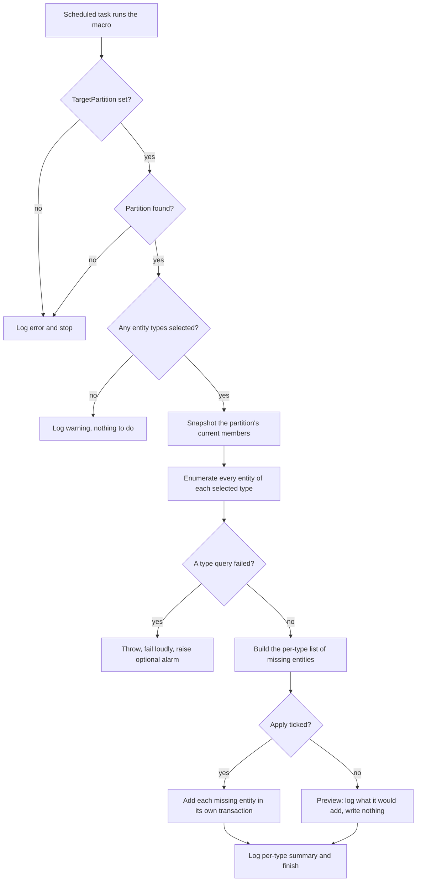
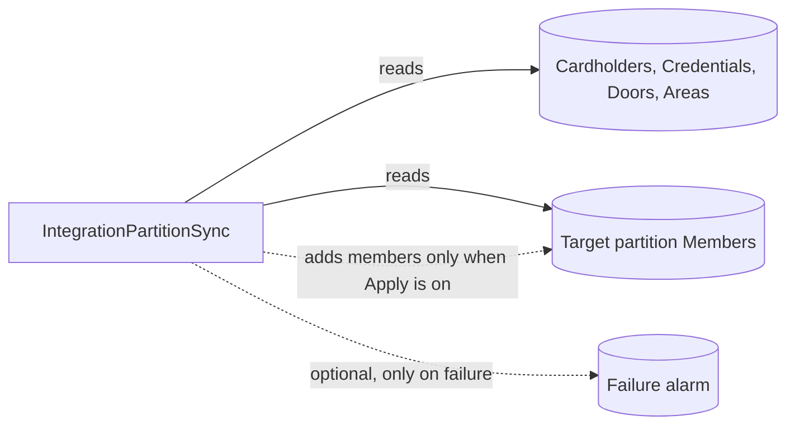

# Integration Partition Sync

Keeps a partition complete for selected entity types, so a third-party integration whose Security Center account is scoped to that partition always sees the full set of entities. It is add-only and never removes anything from any partition.

| | |
|---|---|
| **Platform** | Security Center 5.13 (also targets 5.12) |
| **Macro file** | `IntegrationPartitionSync.cs` (in this folder) |
| **Trigger** | Scheduled (a Config Tool scheduled task). Also runs on demand. |
| **Category** | `Integrations` |
| **Visibility** | Restricted (not published to the public catalog) |
| **Author** | Matthew Netardus |

## Intent

Some integrations connect with a Security Center account that is scoped to a single partition. They only see entities that are members of that partition. When a new cardholder, credential, door, or area is created but never added to the partition, the integration silently misses it. This macro keeps the partition complete by adding any selected-type entity that is not already a member. It is add-only, so it never disturbs membership in any other partition, and its default mode is a safe preview that writes nothing.

## Data it touches

| Item | Type | Read / Write | Notes |
|------|------|--------------|-------|
| Cardholder, Credential, Door, Area entities | The selected types | Read | Enumerated with an `EntityConfigurationQuery`, which also caches them. |
| Target partition `Members` | Partition membership | Read and Write | Read once to diff. Added to only when Apply is on. Never removed from. |
| `TargetPartition` | Parameter (Guid) | Read | Which partition to keep complete. |
| `SyncCardholders` / `SyncCredentials` / `SyncDoors` / `SyncAreas` | Parameter (Boolean) | Read | Which types this integration consumes. |
| `Apply` | Parameter (Boolean) | Read | `false` previews, `true` writes. |
| `FailureAlarm` | Parameter (Guid, optional) | Read | Which alarm to raise if a run fails. |
| Alarm instance | Alarm | Write | One raised only if a run fails and `FailureAlarm` is set. |

The macro needs no custom fields.

## How it works each run

1. Validates `TargetPartition` and looks up the partition. If either is bad, it logs and stops.
2. Builds the list of entity types to scan from the four checkboxes. If none are selected, it logs a warning and stops.
3. Snapshots the partition's current members once.
4. Enumerates every entity of each selected type and builds a per-type list of the entities that are not yet members.
5. If `Apply` is off, it logs what it would add and writes nothing.
6. If `Apply` is on, it adds each missing entity in its own transaction, so one failure does not block the rest.
7. Logs a per-type summary, and raises the optional failure alarm only if the run threw.

If it cannot enumerate the entities, it fails loudly rather than reporting a misleading "nothing to add".

## Flowchart

## Architecture impact

## Prerequisites

- **Privilege:** the account the Macro role runs as must have **Manage partition memberships**, or explicit write access on the target partition. Without it, every add fails and the per-type `errors` count is non-zero.
- A target **partition** to keep complete.
- Optionally, an **alarm** entity if you want a failure alarm.

No custom fields are required.

## Parameters

| Parameter | Type | What to set it to |
|-----------|------|-------------------|
| `TargetPartition` | Guid | The partition to keep complete (entity picker). Required. |
| `SyncCardholders` / `SyncCredentials` / `SyncDoors` / `SyncAreas` | Boolean | Tick the types this integration consumes. |
| `Apply` | Boolean | Leave unticked for a safe preview (logs what it would add, writes nothing). Tick it only when you want the macro to actually add members. |
| `FailureAlarm` | Guid | Optional. Pick an alarm to raise if a run fails. Leave empty for log-only. |

## Import and schedule

1. Open Config Tool, then System, then Macros.
2. Create a new Macro entity and name it `Integration Partition Sync`.
3. Open its source tab and paste the entire contents of `IntegrationPartitionSync.cs`.
4. Apply. Security Center compiles on apply. Fix any reported errors.
5. Set the parameters above. For the first run, set `TargetPartition`, tick the types, and leave `Apply` unticked.
6. Run on demand and read the log. Confirm the `[Type] scanned=... wouldAdd=...` lines look right.
7. Tick `Apply` and run again. The log should now show `added=...`.
8. Create a scheduled task (Config Tool, then Tasks, then Scheduled tasks) with action "Run a macro", select this macro, and set an off-peak recurrence. The macro has no internal timer.

## Failure modes

| What can fail | How it shows in the log | Effect |
|---------------|-------------------------|--------|
| `TargetPartition` is not set | `TargetPartition parameter is empty` | Run stops. |
| The partition GUID points to a deleted entity | `No Partition found` | Run stops. |
| No entity types selected | `No entity types selected` warning | Nothing to do. |
| An entity enumeration query fails | `Entity enumeration query failed for <type>` then `Execute() failed.`, plus the optional alarm | Run fails loudly, no false all-clear. |
| An entity vanished or is not partition-able | `vanished or is not partition-able; skipping` | Counted as an error, the run continues. |
| An add is rejected (no rights) | `Failed to add <type>` and a non-zero `errors` count | That entity is skipped, other entities continue. |

## Risks

- **Add-only and additive.** The macro never removes membership from any partition, so it cannot shrink an integration's view by accident.
- **Safe default.** `Apply` starts unticked, so the first run previews and writes nothing until the operator opts in.
- **Per-entity transactions.** One entity's failure does not poison the batch, and the summary never counts an add that rolled back.
- **Visibility depends on the run-as account.** `scanned` reflects only the entities that account can see. If the account is itself partition-scoped, counts can be lower than the true total. Run the macro as an account with broad read access.

## Rollback / disabling

- **Stop it running:** disable the scheduled task (Config Tool, then Tasks, then Scheduled tasks, set inactive), and/or set the Macro entity to disabled.
- **Undo adds:** the macro never removes membership. If a run added something it should not have, remove that entity from the partition by hand in Config Tool.

## Log strings worth grepping

| Meaning | String |
|---------|--------|
| Run started / finished | `Execute() started.` / `Execute() completed.` |
| Entities read | `Enumerated N <type> entity(ies).` |
| Per-type preview | `wouldAdd=` |
| Per-type applied | `added=` / `errors=` |
| An add failed | `Failed to add` |
| Run failed | `Execute() failed.` |
