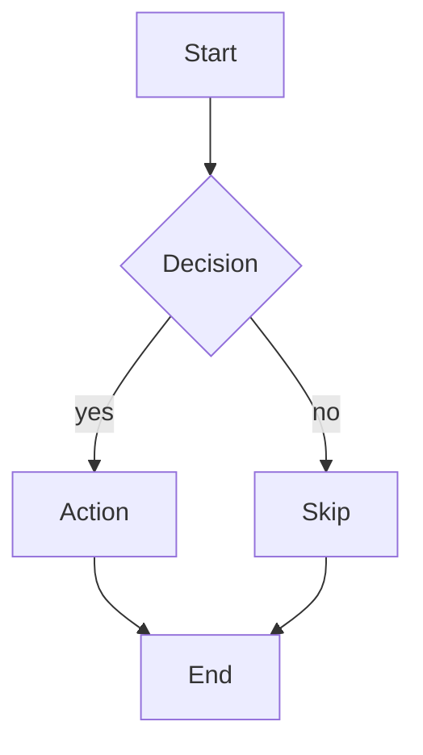
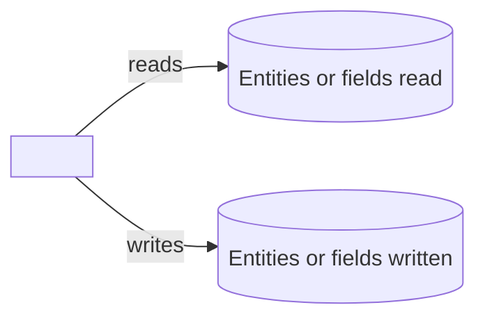

# Repository Reorganization & Macro Standards Implementation Plan

> **For agentic workers:** REQUIRED SUB-SKILL: Use superpowers:subagent-driven-development (recommended) or superpowers:executing-plans to implement this plan task-by-task. Steps use checkbox (`- [ ]`) syntax for tracking.

**Goal:** Land the cross-cutting macro standards (templates, repo README, conformance checklist) on a branch based on main, plus local-only updates to CLAUDE.md and the new-macro skill, so every future macro is organized, documented, and written the same way.

**Architecture:** Standards are macro-independent and land on main. Each macro conforms on its own branch later using the committed conformance checklist. Committed files: `templates/`, repo `README.md`, `docs/conformance-checklist.md`, and the spec and plan docs. Local-only files (gitignored, never committed): `CLAUDE.md` and `.claude/skills/new-macro/SKILL.md`.

**Tech Stack:** Markdown and plain-text templates. Git for version control. No build, no test runner. Verification is done with grep and file checks.

**Branch:** `feature/repo-reorg-macro-standards`, based on main. Already created.

**Tone rule (applies to every file this plan writes):** no em dashes or en dashes, no "e.g."/"i.e."/"etc.", no mention of Claude or AI, no emoji. After writing each file, a grep step confirms compliance.

---

### Task 1: Standard macro header template

**Files:**
- Create: `templates/macro-header.txt`

- [ ] **Step 1: Write the header template file**

Write `templates/macro-header.txt` with exactly this content:

```
// ----------------------------------------------------------------------------
//  <ClassName>.cs
//  <One-line plain-language purpose>
// ----------------------------------------------------------------------------
//  Purpose         <full-sentence description of what it does>
//  Trigger         <Scheduled | Event-driven | On-demand, with how it is run>
//  Category        <Macros subfolder>
//  Platform        Security Center 5.13 (also targets 5.12)
//
//  Reads           <entities and fields it reads>
//  Writes          <entities and fields it writes, or "nothing">
//  Parameters      <name (Type): meaning>
//  Custom fields   <name (Type), or "none">
//  Privileges      <run-as privileges required, or "none beyond default">
//
//  Author          Matthew Netardus
//  Created         YYYY-MM-DD
//  Guide           See README.md in this folder.
// ----------------------------------------------------------------------------
```

- [ ] **Step 2: Verify the file exists and has no tone violations**

Run:
```bash
cd "/home/mnetardus/Anduril/Genetec Macros"
test -f templates/macro-header.txt && echo "exists"
grep -nP '\x{2014}|\x{2013}|\be\.g\.|\bi\.e\.|\betc\.' templates/macro-header.txt && echo "VIOLATION" || echo "tone clean"
```
Expected: `exists` then `tone clean`.

- [ ] **Step 3: Commit**

```bash
cd "/home/mnetardus/Anduril/Genetec Macros"
git add templates/macro-header.txt
git commit -m "feat: add standard macro header template"
```

---

### Task 2: Standard guide (README) template

**Files:**
- Create: `templates/macro-guide-template.md`

- [ ] **Step 1: Write the guide template file**

Write `templates/macro-guide-template.md` with exactly this content:

````markdown
# <Macro Display Name>

<One sentence describing what the macro does and for whom.>

| | |
|---|---|
| **Platform** | Security Center 5.13 (also targets 5.12) |
| **Macro file** | `<ClassName>.cs` (in this folder) |
| **Trigger** | <Scheduled | Event-driven | On-demand> |
| **Category** | `<Macros subfolder>` |
| **Author** | Matthew Netardus |

## Intent

<Two or three sentences on what problem this solves and why it exists. State the
business outcome, not the implementation.>

## Data it touches

List every entity, custom field, and parameter the macro reads or writes. Mark each
as read or write.

| Item | Type | Read / Write | Notes |
|------|------|--------------|-------|
| <entity or field name> | <Door / Cardholder / custom field / parameter> | Read | <what it is used for> |
| <entity or field name> | <...> | Write | <what changes> |

## How it works each run

1. <Step one in plain language.>
2. <Step two.>
3. <Step three.>

## Flowchart



## Architecture impact



## Prerequisites

- <Entity or configuration that must exist before import.>
- <Required custom fields, or state "none".>

## Parameters

| Parameter | Type | What to set it to |
|-----------|------|-------------------|
| `<ParameterName>` | <Guid / Boolean / String / Int32 / DateTime> | <plain instruction> |

## Import and schedule

1. Open Config Tool, then System, then Macros.
2. Create a new Macro entity and name it `<Macro Display Name>`.
3. Open its source tab and paste the entire contents of `<ClassName>.cs`.
4. Apply. Security Center compiles on apply. Fix any reported errors.
5. Set the parameters listed above.
6. <If scheduled: create a Scheduled task that runs this macro at the chosen time.>

## Failure modes

| What can fail | How it shows in the log | Effect |
|---------------|-------------------------|--------|
| <failure one> | `<log string>` | <what happens> |
| <failure two> | `<log string>` | <what happens> |

## Risks

- <Security or operational risk, and the safe-default posture that limits it.>
- <Second risk, if any.>

## Rollback / disabling

- **Stop it running:** <how to disable the macro or its scheduled task.>
- **Undo its writes:** <how to reverse anything it changed, or state that it writes nothing.>

## Log strings worth grepping

| Meaning | String |
|---------|--------|
| Run started / finished | `Execute() started.` / `Execute() completed.` |
| <key decision> | `<log string>` |
| Run failed | `Execute() failed.` |
````

- [ ] **Step 2: Verify the file exists and has no tone violations**

Run:
```bash
cd "/home/mnetardus/Anduril/Genetec Macros"
test -f templates/macro-guide-template.md && echo "exists"
grep -nP '\x{2014}|\x{2013}|\be\.g\.|\bi\.e\.|\betc\.' templates/macro-guide-template.md && echo "VIOLATION" || echo "tone clean"
```
Expected: `exists` then `tone clean`.

- [ ] **Step 3: Commit**

```bash
cd "/home/mnetardus/Anduril/Genetec Macros"
git add templates/macro-guide-template.md
git commit -m "feat: add standard macro guide template"
```

---

### Task 3: Per-macro conformance checklist

**Files:**
- Create: `docs/conformance-checklist.md`

- [ ] **Step 1: Write the checklist file**

Write `docs/conformance-checklist.md` with exactly this content:

```markdown
# Macro Conformance Checklist

Apply this checklist on each macro's own branch to bring it up to the repository
standards. The standards themselves live on main. This checklist is how an existing
macro adopts them.

## Folder shape

- [ ] The macro lives in `Macros/<Category>/<Macro Display Name>/`.
- [ ] The folder contains the `.cs` file, a `README.md`, and a `development/` folder.
- [ ] `development/` holds the macro's final spec and plan, copied from
      `docs/superpowers/` once the macro has shipped.

## Macro file

- [ ] The header matches `templates/macro-header.txt`, with every field filled in.
- [ ] Logging uses `MacroLogger`, not `Logger`.
- [ ] No em dashes, no en dashes, no "e.g.", no "i.e.", no "etc.".
- [ ] No mention of Claude, AI, or "generated by" anywhere.

## Guide

- [ ] `README.md` follows `templates/macro-guide-template.md` section for section.
- [ ] Every entity, custom field, and parameter is listed in "Data it touches".
- [ ] The flowchart and architecture-impact Mermaid diagrams are present and accurate.
- [ ] Failure modes, risks, rollback, and log strings are filled in.
- [ ] Same tone rules as the macro file.

## TechSec Concepts

- [ ] `TechSec Concepts/` holds only flat pre-macro idea markdown.
- [ ] Any per-macro concept or plan docs have moved into that macro's `development/`
      folder.

## Verification

Run from the repo root:

```bash
grep -rnP '\x{2014}|\x{2013}|\be\.g\.|\bi\.e\.|\betc\.' "Macros/<Category>/<Macro Display Name>"
```

Expected: no output.
```

- [ ] **Step 2: Verify the file exists and has no tone violations**

Run:
```bash
cd "/home/mnetardus/Anduril/Genetec Macros"
test -f docs/conformance-checklist.md && echo "exists"
grep -nP '\x{2014}|\x{2013}' docs/conformance-checklist.md && echo "DASH VIOLATION" || echo "dash clean"
```
Expected: `exists` then `dash clean`. This file is an internal checklist, not a macro guide, so the tone rule does not apply to it. It deliberately names the banned tokens ("e.g.", "i.e.", "etc.") in order to forbid them, so only the em-dash and en-dash check is run here.

- [ ] **Step 3: Commit**

```bash
cd "/home/mnetardus/Anduril/Genetec Macros"
git add docs/conformance-checklist.md
git commit -m "docs: add per-macro conformance checklist"
```

---

### Task 4: Rewrite the repository README

**Files:**
- Modify: `README.md` (currently two lines)

- [ ] **Step 1: Overwrite README.md**

Replace the entire contents of `README.md` with:

```markdown
# Genetec Security Center Macros

A collection of C# macros for Genetec Security Center 5.13 (also targets 5.12). Each
macro is a single `.cs` file that you paste into a Macro entity in Config Tool. Security
Center compiles macros at runtime, so there is no local build and no unit tests.

## How this repo is organized

```
Macros/
  <Category>/                       grouped by what the macro is for
    <Macro Display Name>/
      <ClassName>.cs                the macro, the paste target for Config Tool
      README.md                     the operator and developer guide
      development/                  the macro's shipped spec and plan
TechSec Concepts/                   flat markdown for pre-macro ideas
docs/                               working specs, plans, and the conformance checklist
templates/                          the standards every macro follows
```

## The standard every macro follows

- **One folder per macro**, holding the `.cs` file, a `README.md` guide, and a
  `development/` folder.
- **A standard header** at the top of the `.cs` file. See `templates/macro-header.txt`.
- **A standard guide** with a fixed set of sections, including a flowchart and an
  architecture-impact diagram. See `templates/macro-guide-template.md`.
- **Human-written tone** in code and guides. No "e.g.", no em dashes, no AI references.

To bring an existing macro up to standard, follow `docs/conformance-checklist.md`.

## Where planning happens

Specs and plans are drafted under `docs/`. When a macro ships, its final spec and plan
are copied into that macro's `development/` folder as the permanent record. Raw ideas
that are not yet a macro live as flat markdown in `TechSec Concepts/`.

## Starting a new macro

The first three questions are always the macro name, the category it belongs in, and
whether it is event-driven or scheduled. The scaffold then creates the folder, the
`.cs` file with the standard header, and the guide from the template.
```

- [ ] **Step 2: Verify the file and tone**

Run:
```bash
cd "/home/mnetardus/Anduril/Genetec Macros"
grep -nP '\x{2014}|\x{2013}|\be\.g\.|\bi\.e\.|\betc\.' README.md && echo "VIOLATION" || echo "tone clean"
head -1 README.md
```
Expected: `tone clean` then `# Genetec Security Center Macros`.

- [ ] **Step 3: Commit**

```bash
cd "/home/mnetardus/Anduril/Genetec Macros"
git add README.md
git commit -m "docs: describe repo layout and macro standards in README"
```

---

### Task 5: Add the standards section to CLAUDE.md (local only, do NOT commit)

**Files:**
- Modify: `CLAUDE.md` (append a new section near the end, before the final "Code quality" section is fine, or at the end)

**Important:** `CLAUDE.md` is gitignored. This edit is local to the working copy. Do NOT
`git add` or commit it. After editing, confirm git still reports it ignored.

- [ ] **Step 1: Append the new section to CLAUDE.md**

Add this section to `CLAUDE.md`:

```markdown
---

## Repository layout and macro deliverables

### One folder per macro
Every macro lives in `Macros/<Category>/<Macro Display Name>/` and contains exactly
three things:
1. The `.cs` file, PascalCase, matching the class name. This is the paste target.
2. `README.md`, the standardized guide.
3. `development/`, holding the macro's final spec and plan, copied from `docs/` when
   the macro ships.

Keep all existing category folders, including Scheduled and Workflow.

### Standard header
The `.cs` file starts with the header block in `templates/macro-header.txt`, with every
field filled in. Use `MacroLogger`, never `Logger`.

### Standard guide
`README.md` follows `templates/macro-guide-template.md` section for section, including a
Mermaid flowchart and a Mermaid architecture-impact diagram, and a full list of every
entity, custom field, and parameter the macro reads or writes.

### Human-written tone (applies to .cs files and README guides)
- No em dashes or en dashes as punctuation. Use commas, parentheses, or two sentences.
- No "e.g.", "i.e.", or "etc.". Write "for example", "that is", or rephrase.
- No mention of Claude, AI, LLM, or "generated by" anywhere.
- No emoji in code or guides.
- Plain, direct sentences.

### Planning docs (hybrid model)
Drafting happens under `docs/`. When a macro ships, copy its final spec and plan into
that macro's `development/` folder. `TechSec Concepts/` holds only flat pre-macro idea
markdown.

### Starting a new macro
The first three questions are always: macro name, category, and trigger type
(event-driven or scheduled). Then purpose, custom fields, and parameters.

### Bringing an existing macro up to standard
Follow `docs/conformance-checklist.md`.
```

- [ ] **Step 2: Confirm CLAUDE.md is still gitignored and not staged**

Run:
```bash
cd "/home/mnetardus/Anduril/Genetec Macros"
git check-ignore CLAUDE.md && echo "ignored as expected"
git status --short | grep -i 'CLAUDE.md' && echo "UNEXPECTEDLY TRACKED" || echo "not in git status, correct"
```
Expected: `CLAUDE.md` printed by check-ignore, then `ignored as expected`, then `not in git status, correct`.

- [ ] **Step 3: No commit**

This file is intentionally not committed. Do nothing further.

---

### Task 6: Update the new-macro skill (local only, do NOT commit)

**Files:**
- Modify: `.claude/skills/new-macro/SKILL.md`

**Important:** `.claude/` is gitignored. This edit is local only. Do NOT commit it.

- [ ] **Step 1: Update the category list (Step 1, question 2 of the skill)**

In `.claude/skills/new-macro/SKILL.md`, replace the category option list so it reads:

```markdown
2. **Category** - which `Macros/` subfolder. Existing options:
   - `Access Levels`
   - `AccessControl`
   - `Alarms`
   - `Cardholders`
   - `Integrations`
   - `Scheduled`
   - `Workflow`
   A new category folder may be created if none fit.
```

- [ ] **Step 2: Change the write path and add folder scaffolding (Step 3 of the skill)**

Change the target path from `Macros/<Category>/<MacroName>.cs` to a per-macro folder.
The skill must create:
- `Macros/<Category>/<Macro Display Name>/<MacroName>.cs`
- `Macros/<Category>/<Macro Display Name>/README.md` from `templates/macro-guide-template.md`
- `Macros/<Category>/<Macro Display Name>/development/` (empty, add a `.gitkeep`)

- [ ] **Step 3: Replace the generated header with the standard header**

Replace the `// ====` banner header block in the skill's code sample with the block from
`templates/macro-header.txt`, filled from the intake answers.

- [ ] **Step 4: Fix logging in the skill's code sample**

Change `Logger.TraceInformation(...)` to `MacroLogger.TraceInformation(...)` and change
`Logger.TraceError("... " + ex.ToString())` to `MacroLogger.TraceError(ex, "...")`, to
match the verified SDK names in CLAUDE.md.

- [ ] **Step 5: Add the tone rule to the skill's Rules section**

Add a rule: the generated `.cs` and `README.md` must follow the human-written tone rules
(no em dashes, no "e.g.", no AI references).

- [ ] **Step 6: Confirm the skill file is still gitignored and not staged**

Run:
```bash
cd "/home/mnetardus/Anduril/Genetec Macros"
git check-ignore .claude/skills/new-macro/SKILL.md && echo "ignored as expected"
git status --short | grep -i 'new-macro' && echo "UNEXPECTEDLY TRACKED" || echo "not in git status, correct"
```
Expected: the path printed, then `ignored as expected`, then `not in git status, correct`.

- [ ] **Step 7: No commit**

This file is intentionally not committed.

---

### Task 7: Final verification

- [ ] **Step 1: Confirm committed structure**

Run:
```bash
cd "/home/mnetardus/Anduril/Genetec Macros"
git ls-files | grep -E '^templates/|^docs/|^README.md'
```
Expected to include: `README.md`, `templates/macro-header.txt`,
`templates/macro-guide-template.md`, `docs/conformance-checklist.md`,
`docs/superpowers/specs/2026-06-06-repo-reorg-macro-standards-design.md`,
`docs/superpowers/plans/2026-06-06-repo-reorg-macro-standards.md`.

- [ ] **Step 2: Confirm no forbidden paths are tracked**

Run:
```bash
cd "/home/mnetardus/Anduril/Genetec Macros"
git ls-files | grep -E '^\.claude/|^CLAUDE\.md|^Guide/' && echo "FORBIDDEN TRACKED" || echo "clean: no forbidden paths tracked"
```
Expected: `clean: no forbidden paths tracked`.

- [ ] **Step 3: Confirm tone across all committed standards files**

Run:
```bash
cd "/home/mnetardus/Anduril/Genetec Macros"
grep -rnP '\x{2014}|\x{2013}' templates/ README.md docs/conformance-checklist.md && echo "DASH VIOLATION" || echo "no stray dashes"
```
Expected: `no stray dashes`.

---

## Self-review notes

- Spec coverage: templates (Tasks 1, 2), conformance checklist (Task 3), repo README
  (Task 4), CLAUDE.md rules (Task 5), new-macro skill (Task 6). Per-macro conformance is
  intentionally out of scope for this branch and is captured as the checklist in Task 3.
- The deferred public-website recommendation is not a task here. It is produced after
  this plan is executed.
- Local-only files (CLAUDE.md, new-macro skill) have explicit no-commit steps and
  gitignore confirmations so they cannot leak into git.
```
