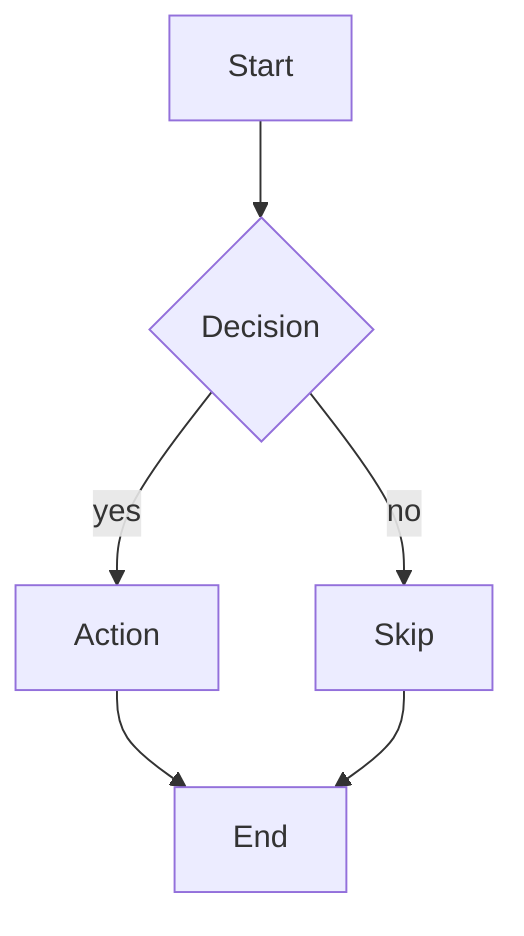
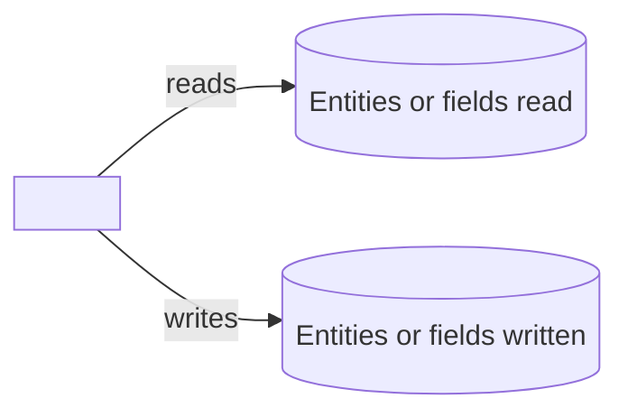

# <Macro Display Name>

<One sentence describing what the macro does and for whom.>

| | |
|---|---|
| **Platform** | Security Center 5.13 (also targets 5.12) |
| **Version** | <MAJOR.MINOR.PATCH> |
| **Macro file** | `<ClassName>.cs` (in this folder) |
| **Trigger** | <Scheduled | Event-driven | On-demand> |
| **Category** | `<Macros subfolder>` |
| **Visibility** | <Public or Restricted. Restricted macros are never published to the public catalog.> |
| **Author** | Matthew Netardus |

## Intent

<Two or three sentences on what problem this solves and why it exists. State the
business outcome, not the implementation.>

## Data it touches

List every entity, custom field, and parameter the macro reads or writes. Mark each
as read or write.

| Item | Type | Read / Write | Notes |
|------|------|--------------|-------|
| <entity or field name> | <Door / Cardholder / custom field / parameter> | Read | <what it is used for> |
| <entity or field name> | <...> | Write | <what changes> |

## How it works each run

1. <Step one in plain language.>
2. <Step two.>
3. <Step three.>

## Flowchart

## Architecture impact

## Prerequisites

- <Entity or configuration that must exist before import.>
- <Required custom fields, or state "none".>

## Parameters

| Parameter | Type | What to set it to |
|-----------|------|-------------------|
| `<ParameterName>` | <Guid / Boolean / String / Int32 / DateTime> | <plain instruction> |

## Import and schedule

1. Open Config Tool, then System, then Macros.
2. Create a new Macro entity and name it `<Macro Display Name>`.
3. Open its source tab and paste the entire contents of `<ClassName>.cs`.
4. Apply. Security Center compiles on apply. Fix any reported errors.
5. Set the parameters listed above.
6. <If scheduled: create a Scheduled task that runs this macro at the chosen time.>

## Failure modes

| What can fail | How it shows in the log | Effect |
|---------------|-------------------------|--------|
| <failure one> | `<log string>` | <what happens> |
| <failure two> | `<log string>` | <what happens> |

## Risks

- <Security or operational risk, and the safe-default posture that limits it.>
- <Second risk, if any.>

## Rollback / disabling

- **Stop it running:** <how to disable the macro or its scheduled task.>
- **Undo its writes:** <how to reverse anything it changed, or state that it writes nothing.>

## If this macro is removed

If the Macro entity is deleted or left disabled:

- **What stops happening:** <the recurring action this macro performed, in plain language>.
- **What keeps working:** <core Security Center behavior that does not depend on this macro, so the reader knows the base system is unaffected>.
- **What breaks or silently lapses:** <any check, sync, or alarm that no longer runs, and why that matters>.
- **What to do instead:** <the manual fallback or alternative, or state that none is needed>.

## Troubleshooting

If the macro behaves unexpectedly, find the symptom below.

| Symptom (what you see) | Likely cause | What to do |
|------------------------|--------------|------------|
| <observed behavior> | <likely cause> | <fix, and the log string from the section below to confirm it> |
| <second symptom> | <likely cause> | <action> |

## Log strings worth grepping

| Meaning | String |
|---------|--------|
| Run started / finished | `Execute() started.` / `Execute() completed.` |
| <key decision> | `<log string>` |
| Run failed | `Execute() failed.` |

## Changelog

Newest version first. The version here matches the Version field in the macro header and the Version row in the table above. A change to the guide alone does not bump the version. The version tracks macro behavior.

### Version <MAJOR.MINOR.PATCH> (YYYY-MM-DD)

- First release.
